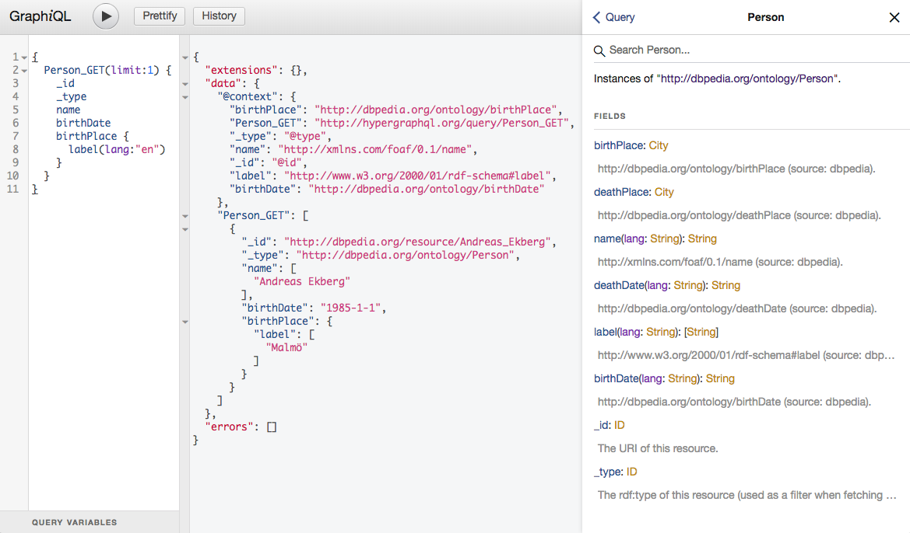

# Overview

HyperGraphQL is a [GraphQL](http://graphql.org) interface for querying and serving [linked data](https://www.w3.org/standards/semanticweb/data) on the Web. It  serves several key objectives and application scenarios:

- hiding the complexities of the Semantic Web stack behind the GraphQL interface, thus enabling access to linked data via a simpler and more familiar to many clients GraphQL interface;
- enforcing a uniform, strict view over heterogeneous linked data sources residing in disconnected multiple services, while preserving the original URIs and semantic links between them; 
- restricting access to linked data services (particularly RDF stores, as one of supported services) down to naturally definable subsets of (tree-shaped) queries, which can be more efficiently handled, thus minimising the impact on the service's availability;
- enabling easy deployment of reasonably sized linked datasets via embedded, in-memory [Apache Jena](https://jena.apache.org/) storage, and exposing them via GraphQL endpoints;
- facilitating construction of microservice-based linked data architectures in a plug-and-play fashion.

To facilitate exploration, each HyperGraphQL instance is by default accompanied by a [GraphiQL](https://github.com/graphql/graphiql) interface:



The core response object of HyperGraphQL is [JSON-LD](https://json-ld.org) (embedded in the standard GraphQL response), which extends JSON with a [JSON-LD context](https://json-ld.org/spec/latest/json-ld-api-best-practices/#dfn-json-ld-context) enabling semantic disambiguation of the served data. Support for other RDF serialisation formats is also provided.

<br/>

# Running

Clone the Git repository into a local directory.

## Running from source

In the root of the project execute the following: 

**NB**: You _**MUST**_ provide at least one configuration file argument

**NB**: Requires Gradle v4.6+

**Gradle**:
1. `gradle build`
2. `gradle execute [-Pa="<comma separated command line args>"]`

e.g.: `gradle execute -Pa="--classpath, --config, config.json"`

## Running from an executable JAR (this is the preferred mechanism)

**Gradle**
1. `gradle clean build shadowJar` 
This will build two JAR files in `build/libs`:
    - `hypergraphql-<version>.jar`, <br/>
    e.g.: `hypergraphql-1.0.0.jar`
    - `hypergraphql-<version>-exe.jar`, <br/>
    e.g. `hypergraphql-1.0.0-exe.jar`
2. Run the executable JAR<br/>
`java -jar build/libs/<exe-jar> [<args>]`, 
<br/>e.g.: `java -jar build/libs/hypergraphql-1.0.0-exe.jar --config /hgql/config/config.json`<br/> 
where `/hgql/config` refers to an absolute server location
3. Deploy this executable JAR onto another container, such as AWS ElasticBeanstalk, see [this section on running in a container](/container/)
4. For an explanation of remote configuration options, see [this section on running in a container](/container/)

The latest (v1.0.0) version of the executable JAR [can be downloaded here](/resources/hypergraphql-1.0.0-exe.jar)

By default, the HyperGraphQL server starts at: 

```
http://localhost:8080/graphql
```

The [GraphiQL](https://github.com/graphql/graphiql) UI is initiated at:

```
http://localhost:8080/graphiql
```

<br/>

# Example

The following query requests a single person instance with its URI (`_id`) and RDF type (`_type`), its name, birth date, birth place with its URI, an English label, and the country in which it is located, also including its URI and an English label. 

### HyperGraphQL query
```
{
  Person_GET(limit: 1, offset: 6) {
    _id
    _type
    name
    birthDate
    birthPlace {
      _id
      label(lang: "en")
      country {
        _id
        label(lang: "en")
      }
    }
  }
}
```

The response to this query consists of the usual GraphQL JSON object, further augmented with a JSON-LD context included as the value of the property `@context` in the `data` object.

### HyperGraphQL response
```json
{
  "extensions": {},
  "data": {
    "Person_GET": [
      {
        "_id": "http://dbpedia.org/resource/Sani_ol_molk",
        "_type": "http://dbpedia.org/ontology/Person",
        "name": "Mirza Abolhassan Khan Ghaffari",
        "birthDate": "1814-1-1",
        "birthPlace": {
          "_id": "http://dbpedia.org/resource/Kashan",
          "label": [
            "Kashan"
          ],
          "country": {
            "_id": "http://dbpedia.org/resource/Iran",
            "label": [
              "Iran"
            ]
          }
        }
      }
    ],
    "@context": {
      "birthPlace": "http://dbpedia.org/ontology/birthPlace",
      "country": "http://dbpedia.org/ontology/country",
      "_type": "@type",
      "name": "http://xmlns.com/foaf/0.1/name",
      "_id": "@id",
      "label": "http://www.w3.org/2000/01/rdf-schema#label",
      "people": "http://hypergraphql.org/query/Person_GET",
      "birthDate": "http://dbpedia.org/ontology/birthDate"
    }
  },
  "errors": []
}
```

It is easy to find out (using e.g. [JSON-LD playground](https://json-ld.org/playground/)) that the `data` node in this response is in fact a valid JSON-LD object encoding the following RDF graph (in N-TRIPLE notation):

```
_:b0 <http://hypergraphql.org/query/Person_GET> <http://dbpedia.org/resource/Sani_ol_molk> .
<http://dbpedia.org/resource/Sani_ol_molk> <http://www.w3.org/1999/02/22-rdf-syntax-ns#type> <http://dbpedia.org/ontology/Person> .
<http://dbpedia.org/resource/Sani_ol_molk> <http://xmlns.com/foaf/0.1/name> "Mirza Abolhassan Khan Ghaffari" .
<http://dbpedia.org/resource/Sani_ol_molk> <http://dbpedia.org/ontology/birthDate> "1814-1-1" .
<http://dbpedia.org/resource/Sani_ol_molk> <http://dbpedia.org/ontology/birthPlace> <http://dbpedia.org/resource/Kashan> .
<http://dbpedia.org/resource/Kashan> <http://www.w3.org/2000/01/rdf-schema#label> "Kashan" .
<http://dbpedia.org/resource/Kashan> <http://dbpedia.org/ontology/country> <http://dbpedia.org/resource/Iran> .
<http://dbpedia.org/resource/Iran> <http://www.w3.org/2000/01/rdf-schema#label> "Iran" .
```
This graph (except for the first triple, added by HyperGraphQL) is a subset of the DBpedia dataset. 

<br/>

# HyperGraphQL instance = configuration + annotated GraphQL schema

To set up a HyperGraphQL instance you only need to provide the top-level configuration, including specification of the linked data services from which the data is to be fetched, and a GraphQL schema. The schema must be annotated with the URIs associated with every field and type in the schema, and with the pointers to the respective linked data services. The complete GraphQL wiring is done automatically on initiating the instance. 

## Service configuration

The configuration of an instance is defined in *config.json* file, located in the root directory of the repository. For example, the following configuration describes an instance pointing at DBpedia's SPARQL endpoint:

```js
{
    "name": "dbpedia-sparql-hgql-demo",
    "schema": "schema.graphql",
    "server": {
        "port": 8080,
        "graphql": "/graphql",
        "graphiql": "/graphiql"
    },
    "services": [
        {
            "id": "dbpedia-sparql",
            "type": "SPARQLEndpointService",
            "url": "http://dbpedia.org/sparql/",
            "graph": "http://dbpedia.org",
            "user": "",
            "password": ""
        }
    ]
}
```

The meaning of the JSON properties is as follows:

* `name`: the name of the instance (currently used only internally for defining schema resources);  
* `schema`: the name (possibly including the path, if not placed in the root) of the file containing GraphQL schema of the instance (see note below); 
* `server`: the HTTP settings of the instance:
  - `port`: the port on which the instance is initiated;
  - `graphql`: the path of the GraphQL server;
  - `graphiql`: the path of the GraphiQL UI;
* `services`: the specification of all services from which the instance is to fetch the data.

Currently, HyperGraphQL supports three types of linked data services: (remote) SPARQL endpoints (`SPARQLEndpointService`), local RDF files (`LocalModelSPARQLService`) and (remote) HyperGraphQL instances (`HGraphQLService`).

#### Short note about `schema` paths

The value of the path in `schema` can be either relative to the path of the containing configuration, or absolute.<br/>
Given the file structure:
```
/
|_hgql
   |_cfg
      |_config.json
      |_schema
         |_schema.graphql         
```
The `schema` could be specified in `config.json` as either:<br/>
Relative:<br/>
`schema: schema/schema.graphql`<br/>
Absolute:<br/>
`schema: /hgql/cfg/schema/schema.graphql`<br/>

It is also completely possible to reference a schema on a different protocol, for example to point to an S3 URL from a 
configuration file on a local filesystem.

### Remote SPARQL endpoints

```json
{
    "id": "dbpedia-sparql",
    "type": "SPARQLEndpointService",
    "url": "http://dbpedia.org/sparql/",
    "graph": "http://dbpedia.org",
    "user": "",
    "password": ""
}
```

* `id`: identifier of the service, used in the GraphQL schema annotations;
* `type`: type of the service - here the constant value of `SPARQLEndpointService`;
* `url`: the URL of the SPARQL endpoint;
* `graph`: the name of the RDF graph to be queried; if the graph is unnamed (default) this property should be set to an empty string `""`;
* `user`, `password`: the basic authentication details; if not applicable these properties should be set to empty strings `"'`.

### Local RDF files

```json
{
    "id": "agrovoc-local",
    "type": "LocalModelSPARQLService",
    "filepath": "agrovoc.ttl",
    "filetype": "TTL"
}
```

* `id`: identifier of the service, used in the GraphQL schema annotations;
* `type`: type of the service - here the constant value of `LocalModelSPARQLService`;
* `filepath`: the local path to the file with the RDF data (absolute, or relative to the run directory of the application);
* `filetype`: the serialisation format of the RDF data; the acronyms follow the convention used in [Jena](https://jena.apache.org/documentation/io/rdf-output.html#jena_model_write_formats) `RDF/XML` (for RDF/XML), `TTL` (for Turtle), `NTRIPLE` (for n-triple).

The RDF file may reside in a remote location; it will be loaded into a local in-memory RDF model for use by the system.

### Remote HyperGraphQL instances

```json
{
    "id": "agrovoc-hgql",
    "type": "HGraphQLService",
    "url": "http://localhost:8082/graphql"
}
```

* `id`: identifier of the service, used in the GraphQL schema annotations;
* `type`: type of the service - here the constant value of `HGraphQLService`;
* `url`: the URL of the GraphQL server of the HyperGraphQL instance.


## Schema

The schema definition complies with the syntax of the [GraphQL schema spec](http://graphql.org/learn/schema/). However, it is required to satisfy a number of structural constraints. The following is an example of a valid HyperGraphQL schema aimed to work over a DBpedia SPARQL endpoint.

```
type __Context {
    Person:         _@href(iri: "http://dbpedia.org/ontology/Person")
    Company:        _@href(iri: "http://dbpedia.org/ontology/Company")
    City:           _@href(iri: "http://dbpedia.org/ontology/City")
    Country:        _@href(iri: "http://dbpedia.org/ontology/Country")
    name:           _@href(iri: "http://xmlns.com/foaf/0.1/name")
    label:          _@href(iri: "http://www.w3.org/2000/01/rdf-schema#label")
    birthPlace:     _@href(iri: "http://dbpedia.org/ontology/birthPlace")
    birthDate:      _@href(iri: "http://dbpedia.org/ontology/birthDate")
    locationCity:   _@href(iri: "http://dbpedia.org/ontology/locationCity")
    owner:          _@href(iri: "http://dbpedia.org/ontology/owner")
    country:        _@href(iri: "http://dbpedia.org/ontology/country")
    leader:         _@href(iri: "http://dbpedia.org/ontology/leaderName")
    country:        _@href(iri: "http://dbpedia.org/ontology/country")
    capital:        _@href(iri: "http://dbpedia.org/ontology/capital")
}

type Person @service(id:"dbpedia-sparql") {
    name: String @service(id:"dbpedia-sparql")
    label: [String] @service(id:"dbpedia-sparql")
    birthPlace: City @service(id:"dbpedia-sparql")
    birthDate: String @service(id:"dbpedia-sparql")
}

type Company @service(id:"dbpedia-sparql") {
    name: [String] @service(id:"dbpedia-sparql")
    label: [String] @service(id:"dbpedia-sparql")
    locationCity: City @service(id:"dbpedia-sparql")
    owner: [Person] @service(id:"dbpedia-sparql")
}

type City @service(id:"dbpedia-sparql") {
    label: [String] @service(id:"dbpedia-sparql")
    country: Country @service(id:"dbpedia-sparql")
    leader: Person @service(id:"dbpedia-sparql")
}

type Country @service(id:"dbpedia-sparql") {
    label: [String] @service(id:"dbpedia-sparql")
    capital: City @service(id:"dbpedia-sparql")
}
```

A HyperGraphQL schema must contain a designated type called `__Context`, which encodes the mapping from every object type and every field to a corresponding IRI used in the target services. For instance, the following line from the schema above informs the instance that the field `name` corresponds to the IRI `http://xmlns.com/foaf/0.1/name`, and therefore this IRI will be used when fetching the values for the field `name` from designated services.

```
name:      _@href(iri: "http://xmlns.com/foaf/0.1/name")
```

Note that each type/field must be mapped to a unique such IRI. Intuitively, GraphQL types should be mapped to IRIs representing RDF/OWL classes, while fields to OWL data properties (whenever the values of the field are scalars, e.g., `String`, `Int`, `Boolean`, `ID`) and OWL object properties (whenever the values of the field are IRI resources).

Types and fields in the schema are annotated with the directives of the form:
```
@service(id:"dbpedia-sparql")
```
which inform the instance from which service the data for given type/field should be fetched. The `id` must correspond to those declared in the `services` section of the configuration file. Currently, only one service can be associated with each type and field. Types annotated with a service id are automatically made queryable, i.e., the HyperGraphQL instance automatically exposes two query fields named: `TypeName_GET` and `TypeName_GET_BY_ID`, e.g.: `Person_GET` and `Person_GET_BY_ID`. Query fields of type `*_GET` are parametrised with arguments `limit:Int` and `offset:Int`, while those of type `*_GET_BY_ID` with the argument `uris:[String]` (see: the [Demo](/demo) section for examples). Annotation of selected types in the schema (and only types) can be skipped. In such cases the type will not become queryable. 

The `Query` type of the type is generated automatically by the service. Additional fields and arguments that are introduced automatically are:
- `_id:String` field, attached to each type in the schema, returning the URI of the resource;
- `_type:String` field, attached to each type in the schema, returning the `rdf:type` of the parent type of this resource in the schema;
- `lang:String` argument, attached to each field in the schema with the value type `String`, which allows to specify the language of the literal to be fetched for the respective field. The recommended argument values follow the convention used in `rdf:langString` (e.g. `en`, `fr`, `de`, etc.)  

<br/>

# Request and response formats

HyperGraphQL accepts POST requests with the body of the form:

```
{
  "query":"{ City_GET(limit:10) {  label(lang:\"en\") _id  } }"
}
```

The default content type is `application/json` for an accept header `application/json`. In such case the response format is a standard GraphQL, JSON-based response that includes a JSON-LD object as a value of the `data` property, e.g.:

```json
{
  "extensions": {},
  "data": {
    "Person_GET": [
      {
        "_id": "http://dbpedia.org/resource/Sani_ol_molk",
        "_type": "http://dbpedia.org/ontology/Person",
        "name": "Mirza Abolhassan Khan Ghaffari",
        "birthDate": "1814-1-1",
        "birthPlace": {
          "_id": "http://dbpedia.org/resource/Kashan",
          "label": [
            "Kashan"
          ],
          "country": {
            "_id": "http://dbpedia.org/resource/Iran",
            "label": [
              "Iran"
            ]
          }
        }
      }
    ],
    "@context": {
      "birthPlace": "http://dbpedia.org/ontology/birthPlace",
      "country": "http://dbpedia.org/ontology/country",
      "_type": "@type",
      "name": "http://xmlns.com/foaf/0.1/name",
      "_id": "@id",
      "label": "http://www.w3.org/2000/01/rdf-schema#label",
      "people": "http://hypergraphql.org/query/Person_GET",
      "birthDate": "http://dbpedia.org/ontology/birthDate"
    }
  },
  "errors": []
}
```

Other supported content types enable replacing the `data` object of the response above with a string of RDF data in selected serialisation format, or serving the entire response purely as RDF data. 

## GraphQL-compatible content types

- `application/json+rdf+xml`
- `application/json+turtle`
- `application/json+ntriples`
- `application/json+n3`

For instance, the response above in `application/json+rdf+xml` is served as:

```json
{
    "extensions": {},
    "data": "<rdf:RDF\n    xmlns:rdf=\"http://www.w3.org/1999/02/22-rdf-syntax-ns#\"\n    xmlns:j.0=\"http://hypergraphql.org/query/\"\n    xmlns:j.1=\"http://dbpedia.org/ontology/\"\n    xmlns:rdfs=\"http://www.w3.org/2000/01/rdf-schema#\"\n    xmlns:j.2=\"http://xmlns.com/foaf/0.1/\">\n  <rdf:Description rdf:about=\"http://hypergraphql.org/query\">\n    <j.0:Person_GET>\n      <j.1:Person rdf:about=\"http://dbpedia.org/resource/Sani_ol_molk\">\n        <j.1:birthDate rdf:datatype=\"http://www.w3.org/2001/XMLSchema#date\"\n        >1814-1-1</j.1:birthDate>\n        <j.1:birthPlace>\n          <j.1:City rdf:about=\"http://dbpedia.org/resource/Kashan\">\n            <j.1:country>\n              <j.1:Country rdf:about=\"http://dbpedia.org/resource/Iran\">\n                <rdfs:label xml:lang=\"en\">Iran</rdfs:label>\n              </j.1:Country>\n            </j.1:country>\n            <rdfs:label xml:lang=\"en\">Kashan</rdfs:label>\n          </j.1:City>\n        </j.1:birthPlace>\n        <j.2:name xml:lang=\"en\">Mirza Abolhassan Khan Ghaffari</j.2:name>\n      </j.1:Person>\n    </j.0:Person_GET>\n  </rdf:Description>\n</rdf:RDF>\n",
    "errors": []
}
```

## Pure RDF content types

- `application/rdf+xml`
- `application/turtle`
- `text/turtle`
- `application/ntriples`
- `text/ntriples`
- `application/n3`
- `text/n3`

For instance, the response above in `application/rdf+xml` is served as:

```
<rdf:RDF
    xmlns:rdf="http://www.w3.org/1999/02/22-rdf-syntax-ns#"
    xmlns:j.0="http://hypergraphql.org/query/"
    xmlns:j.1="http://dbpedia.org/ontology/"
    xmlns:rdfs="http://www.w3.org/2000/01/rdf-schema#"
    xmlns:j.2="http://xmlns.com/foaf/0.1/">
    <rdf:Description rdf:about="http://hypergraphql.org/query">
        <j.0:Person_GET>
            <j.1:Person rdf:about="http://dbpedia.org/resource/Sani_ol_molk">
                <j.1:birthPlace>
                    <j.1:City rdf:about="http://dbpedia.org/resource/Kashan">
                        <j.1:country>
                            <j.1:Country rdf:about="http://dbpedia.org/resource/Iran">
                                <rdfs:label xml:lang="en">Iran</rdfs:label>
                            </j.1:Country>
                        </j.1:country>
                        <rdfs:label xml:lang="en">Kashan</rdfs:label>
                    </j.1:City>
                </j.1:birthPlace>
                <j.2:name xml:lang="en">Mirza Abolhassan Khan Ghaffari</j.2:name>
                <j.1:birthDate rdf:datatype="http://www.w3.org/2001/XMLSchema#date"
        >1814-1-1</j.1:birthDate>
            </j.1:Person>
        </j.0:Person_GET>
    </rdf:Description>
</rdf:RDF>
```

<br/>

# Data fetching and query execution

By principle, HyperGraphQL aims to make as few roundtrips between the local instance and the remote services as possible. On posting the query, the query is  partitioned into maximal subqueries that can be executed independently over respective remote services. After the execution, once the entire relevant data is brought into the local instance, it is then processed using the standard GraphQL fetchers, running locally, in order to construct the final response. 

Depending on the type of the target service the query is either rewritten to SPARQL (remote SPARQL endpoints and local RDF files) or to GraphQL (remote HyperGraphQL instances).

### Rewriting to SPARQL

All top-level query fields are rewritten into instance subqueries as follows:

```
{
  PERSON_GET(limit:1, offset:6) {
    ...
  }
}
```
is rewritten into:
```
{
  SELECT ?subject 
  WHERE {
    ?subject a <http://dbpedia.org/ontology/Person> .
  } LIMIT 1 OFFSET 6
}
...
```

```
{
  PERSON_GET_BY_ID(uris:["http://dbpedia.org/resource/Sani_ol_molk"]) {
    ...
  }
}
```
is rewritten into:
```
  VALUES ?subject { <http://dbpedia.org/resource/Sani_ol_molk> }
  {
    ?subject a <http://dbpedia.org/ontology/Person> .
    ...
  }
```

Fields are translated into optional SPARQL triple patterns, additionally filtered with the RDF type associated with the output type of the field, for instance:
```
{
  ... 
  {
    birthplace 
    ...
  }
}
```
is rewritten:

```
...
  OPTIONAL {
      ?subject <http://dbpedia.org/ontology/birthPlace> ?object .
      ?object a <http://dbpedia.org/ontology/City> .
      ...
  }
```

### Rewriting to GraphQL

Currently, the rewriting to GraphQL is conducted under the assumption that the schemas of the local and the remote HyperGraphQL instances are aligned, meaning that types/fields with the same labels are mapped to the same IRIs, and the output types are associated with the same fields in both schemas. This assumption will be relaxed in the future versions of HyperGraphQL.


<br/>

# Accessing the schema

Similarly to GraphQL, HyperGraphQL supports introspection queries, following the exact same [GraphQL syntax](http://graphql.org/learn/introspection/) (see: [Demo](/demo) section for an example). Additionally, it also exposes its own, internal representation of the schema in the RDF format, which captures also the mapping of types/fields to IRIs and respective services. This representation can be accessed by making a GET request to the HyperGraphQL server endpoint with either of the following accept headers:

- `application/rdf+xml`
- `application/turtle`
- `text/turtle`
- `application/ntriples`
- `text/ntriples`
- `application/n3`
- `text/n3`

In future versions, this representation will also be made available via suitable introspection queries.

<br/>

# Other references

* [Querying DBpedia with GraphQL](https://medium.com/@sklarman/querying-linked-data-with-graphql-959e28aa8013), blog post, Semantic Integration, 2017.
* [Weaving Linked Data Cloud with (Hyper)GraphQL](https://medium.com/@sklarman/weaving-linked-data-cloud-with-hypergraphql-d332d768a1fe), blog post, Semantic Integration, 2018.
* [HyperGraphQL - an overview](https://www.slideshare.net/SzymonKlarman/hypergraphql), presentation, Semantic Integration, 2018.
